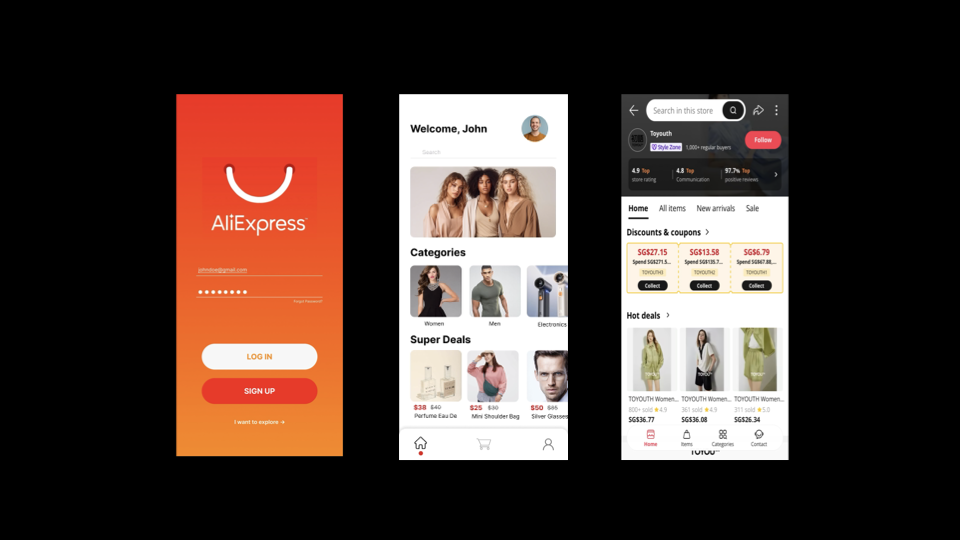
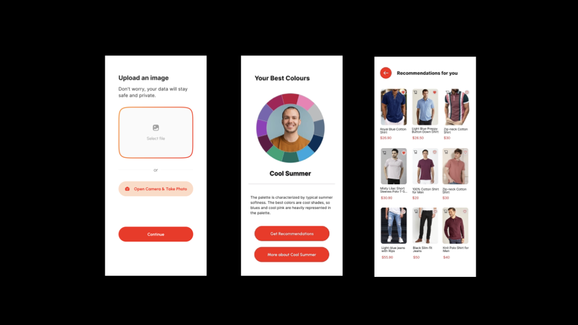

# SuitsMe

SuitsMe was built for the Alibaba Global E-commerce Challenge (GEC) 2024. It is a personalisation tool built to reduce buyer's remorse from purchasing fashion products that consumers eventually realise, doesn't suit them. SuitsMe allows consumers to perform a colour analysis to know which colours suits them best and recommends them fashion products (clothes, shoes, and accessories) in those colours.

# Tech Stack

- React JS
- FastAPI

# UI

# Future Improvements
1) Personalized profiles
Integrate data from multiple sources, including social media to tailor recommendations to current trends and individual style evolution

2) Contextual understanding
Incorporate contextual factors such as lighting conditions, seasonal trends etc to provide more personalized recommendations. Develop algorithms that adjust color recommendations based on the ambient lighting conditions of the uploaded image.

3) Sustainability considerations
Incorporate sustainable fashion practices into color analysis by recommending eco-friendly and ethical brands and products. Allows users to receive recommendations that align with their color preferences while supporting brands committed to sustainability.
